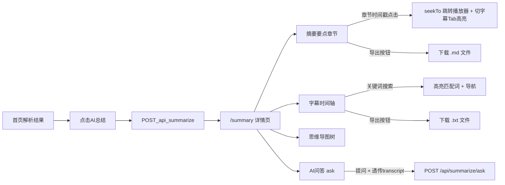

# 速下 SpeedyDL — AI 视频总结方案

> 关联：[竞品调研](./竞品调研-AI视频总结.md) · [API](./API.md) · [方案设计](./方案设计.md)  
> 范围：学习向总结详情页（摘要 · 字幕 · 思维导图 · AI 问答）+ 三项增强能力

---

## 1. 范围确认（已定）

| 项 | 决定 |
|----|------|
| 入口 | 首页结果卡点「AI 总结」→ **跳转 `/summary` 详情页** |
| 详情 Tab | **摘要**（PO 核心）· **字幕/转录（带时间戳）** · **思维导图** · **AI 问答** |
| 字幕 Tab | 轨信息、条数、**关键词搜索高亮**、**匹配导航**、复制、时间跳转、当前句高亮；无字幕时区分「平台无轨 / 拉取失败」 |
| 摘要 Tab | 摘要 + 要点 + **章节时间戳跳转**（跳转后切字幕 Tab 高亮对应句）+ **导出 Markdown** |
| 文本来源 | **B 站官方 CC/AI** → **yt-dlp** → **用户字幕** → **弹幕** → **元数据**（不做 Whisper / OCR） |
| 后端模块 | `bilibili_subs`（B站官方字幕）· `SubtitleExtractor` · `VideoSummarizer` |
| 推送 | 总结进度与问答均支持 **SSE**（`/api/summarize/stream` · `/api/chat`） |
| 模型 | OpenAI 兼容；无 Key 自动 Mock；**LLM JSON 解析容错**（解析失败降级兜底） |
| 门禁 | 演示 VIP（`vip_token=demo-vip`） |

### 1.1 本轮新增三项能力

| 能力 | 说明 | 改动位置 |
|------|------|----------|
| **章节时间戳跳转增强** | 章节点击跳转播放器后，自动切字幕 Tab、清除搜索、按时间高亮对应句并滚动到可视区 | `SummaryView.vue` seekTo 函数 |
| **字幕搜索高亮** | 搜索关键词时命中词用 `<mark>` 标黄高亮（先 HTML 转义防 XSS），当前匹配项橙色区分；↑/↓ 导航 + 计数 | `SummaryView.vue` highlightHtml / match-nav |
| **导出 Markdown/TXT** | 摘要 Tab 导出 `.md`（标题/摘要/要点/章节），字幕 Tab 导出 `.txt`（时间戳字幕）；文件名安全处理 | `exportFile.js` + SummaryView 导出按钮 |

---

## 2. 流程



---

## 3. API

| 方法 | 路径 | 说明 |
|------|------|------|
| POST | `/api/summarize` | 摘要、要点、章节、`transcript`、`mind_map`（异步任务） |
| GET | `/api/summarize/stream/{task_id}` | SSE：总结进度 `progress` / `done` / `error` |
| POST | `/api/summarize/ask` | 针对视频内容提问（同步 JSON，兼容） |
| POST | `/api/chat` | 针对视频内容提问（SSE：`status` / `token` / `done` / `error`） |

总结响应关键字段：`summary` · `key_points` · `chapters` · `transcript[{start,text}]` · `mind_map{name,children[]}` · `mode` · `source`

问答请求：`url` + `question` + `vip_token` + 可选 `lang` + 可选 `transcript[{start,text}]`

> **优化**：问答时前端传入已有 `transcript`，后端 `ask_about_video` 直接复用，跳过 `parse_video` + 字幕拉取，减少重复网络请求。

---

## 4. 前端

| 路径 | 组件 | 说明 |
|------|------|------|
| `/` | `views/HomeView.vue` | 解析入口 + AI 总结按钮 |
| `/summary` | `views/SummaryView.vue` | 四 Tab + 三项新能力 |
| 导图节点 | `components/MindMapNode.vue` | 递归树 |
| 播放器工具 | `utils/embedPlayer.js` | 时间戳解析 + embed URL 构建 |
| **文件导出工具** | `utils/exportFile.js` | `downloadMarkdown` / `downloadTxt` / `safeFilename` |

### 4.1 SummaryView 关键函数

| 函数 | 作用 |
|------|------|
| `seekTo(ts)` | 跳转播放器 + 切字幕 Tab + 清除搜索 + 滚动到对应字幕 |
| `highlightHtml(text, index)` | HTML 转义 + `<mark>` 高亮关键词，当前匹配项加 `.is-current` |
| `goPrevMatch` / `goNextMatch` | 匹配导航，循环切换 + `scrollIntoView` |
| `exportMarkdown` | 调用 `formatPlain()` 生成 Markdown，下载 `.md` |
| `exportTranscriptTxt` | 调用 `formatTranscriptPlain()` 生成纯文本，下载 `.txt` |

---

## 5. 后端容错

### 5.1 LLM JSON 解析容错

`_extract_json(content)` 两级策略：
1. 直接 `json.loads`（理想情况）
2. 提取第一个 `{` 到最后一个 `}` 之间的片段再解析（处理 LLM 在 JSON 前后加说明文字）

解析失败时 `_call_llm` 降级为结构化兜底（原始文本作 summary，空数组兜底要点/章节），不崩溃。

### 5.2 _chat_completion 网络异常容错

- `HTTPStatusError` → 友好 ValueError（含状态码 + 响应前 200 字）
- `RequestError` → 友好 ValueError（含异常信息）
- 返回结构异常 → 友好 ValueError

### 5.3 ask_about_video transcript 复用

前端传入 `transcript` 时跳过 `_resolve_context`，避免重复 `parse_video` + 字幕拉取。

---

## 6. 验收清单

### 6.1 基础四 Tab

1. 演示会员 + 有字幕视频：点 AI 总结 → 进入详情页，四 Tab 可用
2. 无 Key：`mode=mock`，摘要/导图/问答均可演示
3. 字幕 Tab 展示时间戳；可搜索
4. 思维导图展示树形结构
5. AI 问答可发送问题并得到回答
6. 未开会员：403 / 前端提示开通
7. `pytest tests/test_summarize.py` 通过

### 6.2 新增三项能力

8. **章节跳转**：摘要 Tab 点击章节时间戳 → 播放器跳转 + 自动切字幕 Tab + 对应句高亮并滚动到可视区
9. **字幕搜索高亮**：输入关键词 → 命中词标黄高亮；当前匹配项橙色；↑/↓ 可循环导航；显示 `N/M` 计数
10. **导出 Markdown**：摘要 Tab 点「导出 Markdown」→ 下载 `{标题}.md`，内容含标题/摘要/要点/章节
11. **导出 TXT**：字幕 Tab 点「导出 TXT」→ 下载 `{标题}-字幕.txt`，内容为带时间戳的字幕文本

### 6.3 容错验证

12. **LLM 返回非 JSON**：`_call_llm` 不崩溃，降级为兜底结构
13. **LLM 返回带前缀文字的 JSON**：`_extract_json` 能提取出 JSON 对象
14. **问答透传 transcript**：后端不重复 `parse_video`，直接用前端传入的字幕回答

### 6.4 双模式验收

15. **Mock 模式**：无 `SPEEDYDL_AI_API_KEY`，四 Tab + 三项新能力全部可用
16. **真实 LLM 模式**：配置 `SPEEDYDL_AI_API_KEY` 后用有字幕视频验证 LLM 总结 + 问答

---

## 7. 环境变量

```bash
SPEEDYDL_AI_API_KEY=sk-...
SPEEDYDL_AI_BASE_URL=https://api.deepseek.com/v1
SPEEDYDL_AI_MODEL=deepseek-chat
SPEEDYDL_AI_REQUIRE_VIP=1
SPEEDYDL_AI_MAX_SUBTITLE_CHARS=12000
```

---

## 8. 测试覆盖

`tests/test_summarize.py` 覆盖：

| 测试 | 说明 |
|------|------|
| `test_parse_subtitle_cues` | VTT 字幕解析 |
| `test_parse_srt_with_index` | SRT 字幕解析（带序号） |
| `test_subtitle_candidates_prefer_zh` | 字幕轨中文优先排序 |
| `test_chapters_from_cues_have_timestamps` | 章节时间戳生成 |
| `test_build_mind_map` | 思维导图树构建 |
| `test_mock_summary_structure` | Mock 总结结构完整性 |
| `test_mock_summary_metadata_fallback` | 无字幕 Mock 降级 |
| `test_ask_mock_without_key` | Mock 问答 |
| `test_summarize_requires_vip` | 总结 VIP 门禁 |
| `test_ask_requires_vip` | 问答 VIP 门禁 |
| `test_summarize_mock_with_vip` | VIP + Mock 完整流程 |
| `test_health_lists_summarize_and_ask` | 健康检查特性声明 |
| **`test_extract_json_direct`** | JSON 直接解析 |
| **`test_extract_json_with_prefix_text`** | 带前缀文字的 JSON 提取 |
| **`test_extract_json_with_code_fence`** | 纯 JSON 解析 |
| **`test_extract_json_invalid_raises`** | 无效内容抛 ValueError |
| **`test_call_llm_json_parse_fallback`** | LLM 非 JSON 降级兜底 |
| **`test_ask_with_transcript_skips_resolve_context`** | transcript 复用跳过解析 |
| **`test_ask_without_transcript_calls_resolve_context`** | 无 transcript 回退解析 |
| **`test_ask_endpoint_accepts_transcript`** | 路由透传 transcript |
