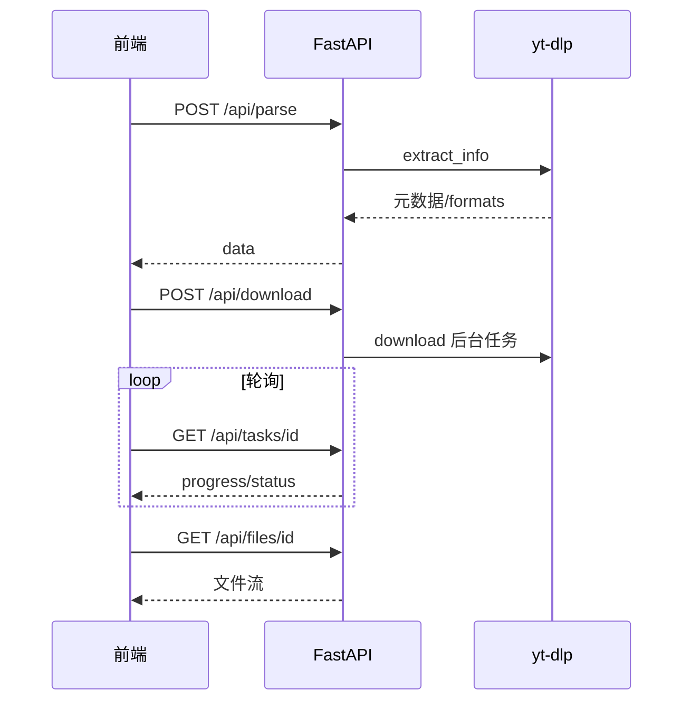

# 速下 SpeedyDL — 接口文档

版本：`0.3.0`  
Base URL（本地）：`http://127.0.0.1:8000`  
交互式文档：`http://127.0.0.1:8000/docs`（Swagger） / `http://127.0.0.1:8000/redoc`

> 仅供个人学习。请尊重版权与各平台服务条款。  
> 关联文档：[需求分析](./需求分析.md) · [方案设计](./方案设计.md) · [部署文档](./部署文档.md)

---

## 约定

| 项 | 说明 |
|----|------|
| 协议 | HTTP/1.1，JSON 请求体 `Content-Type: application/json` |
| 字符集 | UTF-8 |
| CORS | 允许 `localhost` / `127.0.0.1` / 常见局域网 IP 的前端端口 |
| VIP | 演示令牌：请求体字段 `vip_token` 传 `"demo-vip"` 可解锁超过免费清晰度（默认 >720p） |
| 错误体 | `{ "detail": "错误说明字符串" }` |

### 通用错误码

| HTTP | 含义 |
|------|------|
| 400 | 参数错误 / 解析失败 / 业务失败 |
| 403 | 超过免费清晰度且未带有效 VIP |
| 404 | 资源不存在或已清理 |
| 409 | 下载任务未完成，文件未就绪 |
| 429 | 并发下载任务已满（默认最多 2 个） |
| 502 | 封面代理拉取失败 |

---

## 接口一览

| 方法 | 路径 | 说明 |
|------|------|------|
| GET | `/api/health` | 健康检查 |
| POST | `/api/parse` | 解析视频元数据、格式、字幕列表 |
| POST | `/api/download` | 创建服务端下载任务（模式①） |
| GET | `/api/tasks/{task_id}` | 查询下载进度 |
| GET | `/api/files/{task_id}` | 下载已完成的文件 |
| POST | `/api/direct` | 解析单流直链（模式②） |
| POST | `/api/subtitles/download` | 下载字幕文件 |
| POST | `/api/summarize` | AI 视频总结（摘要/字幕/导图；无 Key 时 Mock） |
| POST | `/api/summarize/ask` | 针对视频内容的 AI 问答 |
| GET | `/api/thumbnail` | 封面图代理（防盗链） |

---

## 1. 健康检查

`GET /api/health`

### 响应示例

```json
{
  "ok": true,
  "brand": "速下",
  "free_max_height": 720,
  "features": ["parse", "download", "direct", "subtitles", "summarize", "ask", "progress"],
  "notice": "仅供个人学习，请尊重版权，勿用于商业传播"
}
```

---

## 2. 解析视频

`POST /api/parse`

解析页面链接，返回标题、封面、清晰度列表、字幕列表等。不落盘视频文件。

### 请求体

```json
{
  "url": "https://www.bilibili.com/video/BV1xxxxxx"
}
```

| 字段 | 类型 | 必填 | 说明 |
|------|------|------|------|
| url | string | 是 | 以 `http://` 或 `https://` 开头 |

### 成功响应

```json
{
  "ok": true,
  "data": {
    "id": "BV1xxxxxx",
    "title": "视频标题",
    "thumbnail": "https://...",
    "duration": 3264,
    "duration_string": "54:24",
    "uploader": "UP主名称",
    "webpage_url": "https://...",
    "extractor": "BiliBili",
    "original_url": "https://...",
    "formats": [
      {
        "format_id": "30064+bestaudio/best",
        "ext": "mp4",
        "height": 720,
        "width": 1280,
        "fps": 30,
        "filesize": 226492416,
        "vcodec": "avc1",
        "acodec": "none",
        "has_video": true,
        "has_audio": true,
        "label": "720p · MP4 · 自动合并音轨",
        "vip_required": false,
        "format_note": "...",
        "needs_merge": true,
        "can_direct": false
      }
    ],
    "subtitles": [
      {
        "lang": "zh-Hans",
        "name": "Chinese",
        "ext": "vtt",
        "automatic": false,
        "url": "https://..."
      }
    ]
  }
}
```

### `formats` 字段说明

| 字段 | 说明 |
|------|------|
| format_id | 传给下载 / 直链接口的格式标识 |
| vip_required | `true` 时需 VIP（高度 > 720） |
| needs_merge | 是否需 ffmpeg 合并音视频 |
| can_direct | 是否适合走 `/api/direct`（一般为单流且无需合并） |
| filesize | 字节数，可能为 `null` |

### `subtitles` 字段说明

| 字段 | 说明 |
|------|------|
| lang | 语言代码，下载字幕时原样传入 |
| automatic | `true` 表示机翻/自动字幕 |
| ext | 推荐扩展名（vtt/srt 等） |

无字幕时 `subtitles` 为空数组。

---

## 3. 创建下载任务（服务端落盘）

`POST /api/download`

后台用 yt-dlp 下载到服务器临时目录，前端轮询进度后用 `/api/files/{id}` 取文件。

### 请求体

```json
{
  "url": "https://www.bilibili.com/video/BV1xxxxxx",
  "format_id": "30064+bestaudio/best",
  "height": 720,
  "vip_token": null
}
```

| 字段 | 类型 | 必填 | 说明 |
|------|------|------|------|
| url | string | 是 | 视频页 URL |
| format_id | string | 是 | 来自解析结果 |
| height | int \| null | 否 | 用于 VIP 校验辅助 |
| vip_token | string \| null | 否 | `"demo-vip"` 解锁高清 |

### 成功响应

```json
{
  "ok": true,
  "task": {
    "id": "a1b2c3d4e5f6...",
    "status": "running",
    "progress": 0.0,
    "speed": null,
    "eta": null,
    "error": null,
    "filename": null,
    "ready": false
  }
}
```

### `task.status`

| 值 | 含义 |
|----|------|
| pending | 排队中 |
| running | 下载中 |
| done | 完成，可取文件 |
| error | 失败，见 `error` |

临时文件默认约 **15 分钟** 后清理；同时进行的任务默认最多 **2** 个。

---

## 4. 查询任务进度

`GET /api/tasks/{task_id}`

### 路径参数

| 参数 | 说明 |
|------|------|
| task_id | `/api/download` 返回的 `task.id` |

### 成功响应

```json
{
  "ok": true,
  "task": {
    "id": "a1b2c3d4e5f6...",
    "status": "running",
    "progress": 42.5,
    "speed": "1.2 MB/s",
    "eta": "30s",
    "error": null,
    "filename": null,
    "ready": false
  }
}
```

`status === "done"` 且 `ready === true` 时可请求文件接口。

---

## 5. 取回已下载文件

`GET /api/files/{task_id}`

### 响应

- 成功：二进制文件流（`Content-Disposition: attachment`）
- 409：任务未完成
- 404：任务不存在或文件已清理

### 调用建议

```text
轮询 GET /api/tasks/{id}
  → status=done && ready=true
  → 浏览器跳转或 fetch GET /api/files/{id}
```

---

## 6. 解析直链（不落盘）

`POST /api/direct`

解析**单流**可播放/可下载 URL，服务器不保存视频。  
若 `format_id` 含 `+`（需合并音视频），返回 400。

### 请求体

```json
{
  "url": "https://www.bilibili.com/video/BV1xxxxxx",
  "format_id": "30280",
  "height": null,
  "vip_token": null
}
```

字段含义同 `/api/download`。

### 成功响应

```json
{
  "ok": true,
  "data": {
    "url": "https://cdn.example.com/xxx.m4a?...",
    "ext": "m4a",
    "format_id": "30280",
    "http_headers": {},
    "note": "直链可能有时效与防盗链，部分平台浏览器无法直接打开；失败请改用服务端下载"
  }
}
```

### 注意

- 直链常带签名、短时效或需要特定 Referer/Cookie
- 合并清晰度请用 `/api/download`，不要用本接口

---

## 7. 下载字幕

`POST /api/subtitles/download`

按语言下载字幕文件，响应为文件流。

### 请求体

```json
{
  "url": "https://www.youtube.com/watch?v=xxxx",
  "lang": "zh-Hans",
  "automatic": false
}
```

| 字段 | 类型 | 必填 | 说明 |
|------|------|------|------|
| url | string | 是 | 视频页 URL |
| lang | string | 是 | 来自解析结果 `subtitles[].lang` |
| automatic | bool | 否 | 是否自动字幕，默认 `false`；需与解析结果一致 |

### 响应

成功：字幕文件（如 `.vtt` / `.srt`）  
失败：JSON `{ "detail": "..." }`

### 前端示例（blob 下载）

```js
const res = await fetch('/api/subtitles/download', {
  method: 'POST',
  headers: { 'Content-Type': 'application/json' },
  body: JSON.stringify({ url, lang, automatic }),
})
const blob = await res.blob()
// 再创建 a[download] 触发保存
```

---

## 7.1 AI 视频总结

`POST /api/summarize`

创建后台总结任务，立即返回 `task_id`。文本来源：B 站官方 CC/AI（dm/view）→ yt-dlp → 用户粘贴/上传 → 弹幕 → 元数据。不做 Whisper / OCR。未配置 `SPEEDYDL_AI_API_KEY` 时 Mock。详情页见前端 `/summary`。详见 [AI视频总结方案](./AI视频总结方案.md)。

### 请求体

```json
{
  "url": "https://www.bilibili.com/video/BVxxxx",
  "lang": "zh-Hans",
  "automatic": false,
  "vip_token": "demo-vip",
  "title": "可选标题"
}
```

| 字段 | 类型 | 必填 | 说明 |
|------|------|------|------|
| url | string | 是 | 视频页 URL |
| lang | string | 否 | 字幕语言；省略则自动优选 |
| automatic | bool | 否 | 是否自动字幕 |
| vip_token | string | 条件 | 默认需 `demo-vip` |
| title | string | 否 | 可选，辅助 Mock/提示词 |

### 成功响应

```json
{ "ok": true, "task_id": "abc123" }
```

随后可用轮询或 SSE 取结果：

- `GET /api/summarize/status/{task_id}`
- `GET /api/summarize/stream/{task_id}`（SSE：`progress` / `done` / `error`）

任务完成后 `task.data` 关键字段：

| 字段 | 说明 |
|------|------|
| mode | `mock` 未配置 Key；`llm` 已调用兼容 Chat Completions |
| source | `subtitles` 平台/官方字幕（含 B 站 AI）；`user` 用户粘贴；`danmaku` 弹幕；`metadata` 仅标题/简介 |
| transcript | 带时间戳字幕列表（过长会截断，见 `transcript_truncated`） |
| mind_map | 树形导图 `{name, children[]}` |
| chapters | 有字幕时尽量给出带 `start` 时间戳的大纲；无则空数组 |

---

## 7.2 AI 问答

### 同步（兼容）

`POST /api/summarize/ask`

```json
{
  "url": "https://www.bilibili.com/video/BVxxxx",
  "question": "核心结论是什么？",
  "vip_token": "demo-vip",
  "transcript": [{"start": "00:01", "text": "…"}]
}
```

响应：`{ ok, data: { mode, answer, question, source, warning } }`

### 流式 SSE（推荐）

`POST /api/chat`

请求体同上。`Content-Type: text/event-stream`，事件：

| event | 说明 |
|-------|------|
| status | `{ message }` 阶段提示 |
| token | `{ text }` 增量文本 |
| done | 完整 `data`（同同步接口） |
| error | `{ error }` |

---

## 8. 封面代理

`GET /api/thumbnail`

浏览器直连部分平台 CDN 会因 Referer 被 403，经本接口代理后返回图片。

### Query 参数

| 参数 | 必填 | 说明 |
|------|------|------|
| url | 是 | 原始封面 URL（需 URL 编码） |
| page | 否 | 视频页 URL，用作上游 Referer |

### 示例

```
GET /api/thumbnail?url=https%3A%2F%2Fi0.hdslb.com%2Fbfs%2F...&page=https%3A%2F%2Fwww.bilibili.com%2Fvideo%2FBV1xxx
```

### 响应

成功：`image/jpeg` 等图片二进制  
失败：400 / 502

---

## 典型调用流程

### A. 服务端下载（推荐，兼容合并清晰度）



### B. 直链（仅单流）

```text
POST /api/parse → 选 can_direct=true 的 format
→ POST /api/direct → 复制 data.url
```

### C. 字幕

```text
POST /api/parse → 选 subtitles 项
→ POST /api/subtitles/download → 保存文件
```

---

## cURL 示例

```bash
# 健康检查
curl http://127.0.0.1:8000/api/health

# 解析
curl -X POST http://127.0.0.1:8000/api/parse \
  -H "Content-Type: application/json" \
  -d "{\"url\":\"https://www.bilibili.com/video/BV1GJ411x7h7\"}"

# 创建下载（720p 示例，format_id 以解析结果为准）
curl -X POST http://127.0.0.1:8000/api/download \
  -H "Content-Type: application/json" \
  -d "{\"url\":\"https://www.bilibili.com/video/BV1GJ411x7h7\",\"format_id\":\"30064+bestaudio/best\",\"height\":720}"

# 查进度
curl http://127.0.0.1:8000/api/tasks/<task_id>

# 取文件
curl -OJ http://127.0.0.1:8000/api/files/<task_id>

# 直链（单流 format_id）
curl -X POST http://127.0.0.1:8000/api/direct \
  -H "Content-Type: application/json" \
  -d "{\"url\":\"https://www.bilibili.com/video/BV1GJ411x7h7\",\"format_id\":\"30280\"}"

# 字幕
curl -X POST http://127.0.0.1:8000/api/subtitles/download \
  -H "Content-Type: application/json" \
  -d "{\"url\":\"https://www.youtube.com/watch?v=xxxx\",\"lang\":\"zh-Hans\",\"automatic\":false}" \
  -o subtitle.vtt
```

---

## 与前端联调

开发时前端 Vite（默认 `5173`）将 `/api` 代理到本后端，浏览器可直接请求相对路径 `/api/...`，无需写完整 Base URL。

生产环境请将前端 `Origin` 加入 CORS，或用反向代理同源转发 `/api`。具体步骤见 [部署文档](./部署文档.md)。
