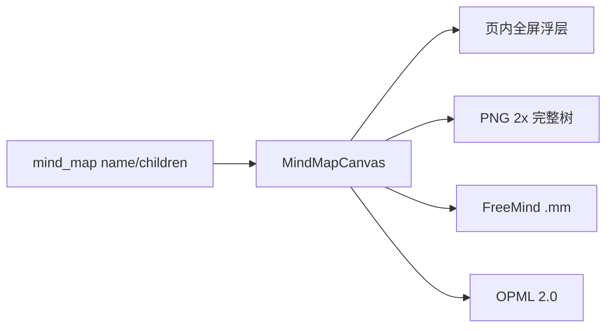

# 速下 SpeedyDL — 思维导图增强方案

> 关联：[AI视频总结方案](./AI视频总结方案.md) · [竞品调研](./竞品调研-AI视频总结.md)  
> 范围：全屏阅读 · 高清 PNG · 可导入主流导图编辑器的结构化导出

---

## 1. 需求确认（已定）

| 项 | 决定 |
|----|------|
| 阅读空间 | **页内全屏浮层**（盖住详情页，Esc / 按钮退出） |
| 高清图 | **PNG @ 2x**，按**完整展开树**渲染（不受当前折叠影响） |
| 可编辑互通 | **FreeMind `.mm` + OPML `.opml`** |
| 不做 | 浏览器原生 Fullscreen API、原生 `.xmind` ZIP、服务端渲染 |

---

## 2. 竞品与格式调研摘要

| 软件 | 可导入继续编辑 |
|------|----------------|
| XMind | FreeMind `.mm`、OPML、Markdown |
| 幕布 | FreeMind `.mm`、OPML、XMind |
| 亿图脑图 / MindMaster | FreeMind、OPML、Markdown、XMind |
| ProcessOn / 百度脑图等 | 多支持 FreeMind |

**选型理由**：

- `.mm`：国内导图互通的「最大公约数」，幕布 ↔ XMind 官方也推荐经 FreeMind 中转。
- `.opml`：大纲工具与另一批导入器的标准格式，实现简单、无第三方依赖。
- 原生 `.xmind`：ZIP + `content.json`，成本高且有 `.mm`/`opml` 后非必需。

现有能力：[`MindMapCanvas.vue`](../web/src/components/MindMapCanvas.vue) 已有缩放 / 拖拽 / 折叠 / 导出 SVG；画布高度约 `min(72vh, 720px)`，偏小。

---

## 3. 方案设计

### 3.1 数据不变

后端仍返回 `mind_map: { name, children[] }`，本轮**纯前端**增强，不改 API。

### 3.2 全屏

- 工具栏增加「全屏」；进入后 `.mmc` 变为 `position: fixed; inset: 0; z-index` 高层。
- Esc 或「退出全屏」还原；进入/退出后 `fitView()`。
- `body` 滚动锁定，避免底层页面滚动干扰。

### 3.3 导出

| 格式 | 行为 |
|------|------|
| PNG | 对**完整展开**树生成 SVG → Canvas @ `scale=2` → 下载 `.png` |
| FreeMind | 递归写 `<map><node TEXT="…">` → `.mm` |
| OPML | OPML 2.0 `<outline text="…">` → `.opml` |
| SVG | 保留现有矢量导出（完整树） |

结构化导出始终基于**完整树**（忽略界面折叠状态），避免用户导入后缺分支。

### 3.4 文件落点

| 路径 | 职责 |
|------|------|
| `web/src/utils/mindMapExport.js` | 树 → `.mm` / `.opml` / SVG 字符串；PNG 光栅化；下载触发 |
| `web/src/components/MindMapCanvas.vue` | 全屏态、导出菜单、调用工具 |
| `web/src/style.css` | `.mmc.is-fullscreen` 等样式 |

---

## 4. 验收标准

1. 思维导图 Tab 可一键全屏，Esc 可退出，全屏下缩放/拖拽/折叠仍可用。
2. 下载 PNG 为清晰位图，含完整节点（折叠状态下导出也不丢分支）。
3. `.mm` 可被 XMind / 幕布等「导入 FreeMind」打开并编辑。
4. `.opml` 可被支持 OPML 的工具导入并编辑。
5. 无新增 npm 依赖；现有总结/下载主路径不受影响。

---

## 5. 测试计划

- 手工：Mock / 真实总结页 → 全屏进出 → 四种导出文件落地。
- 脚本：对 `toFreeMindXml` / `toOpmlXml` 做 Node 断言（转义、嵌套、空树）。
