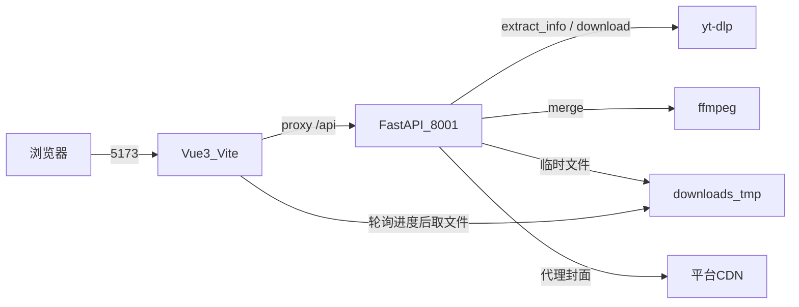
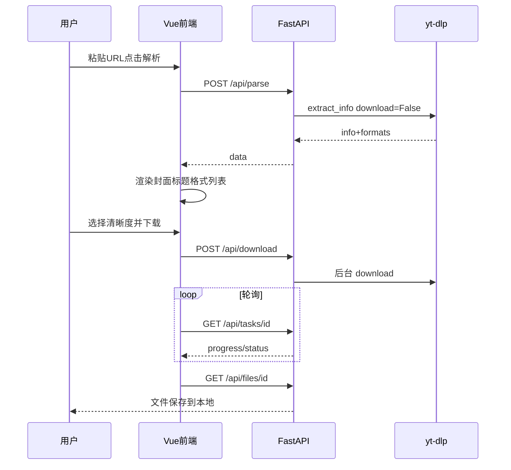

# 速下 SpeedyDL — 方案设计文档

> 文档用途：记录技术选型、架构、模块职责与阶段 3 核心流程，供后续扩展及 AI 辅助开发参考。  
> 关联文档：[需求分析](./需求分析.md) · [接口文档](./API.md) · [部署文档](./部署文档.md)

---

## 1. 总体方案

### 1.1 技术选型

| 层级 | 选型 | 理由 |
|------|------|------|
| 后端 | FastAPI + uvicorn | 现代、自带 OpenAPI、异步友好、上手快 |
| 下载引擎 | yt-dlp（Python API）+ 抖音分享页无 Cookie 解析 | 社区主流；抖音单独绕过 Cookie 门槛 |
| 合并 | 系统 ffmpeg | 分离音视频流合并 |
| 前端 | Vue 3 + Vite | 前后端分离、热更新、上手简单 |
| 样式 | 自研 CSS（对齐参考站） | 阶段 3 一次性做到位；未强制 Tailwind |
| 存储 | 无 DB；内存任务表 + 临时目录 | 轻量学习向 |

### 1.2 架构图



### 1.3 仓库结构

```text
d:\luli\
  app\                    # FastAPI 后端
    main.py               # 路由、CORS
    config.py             # 常量（免费清晰度、TTL、并发、AI）
    downloader.py         # yt-dlp 薄封装（parse/download/direct/字幕）
    douyin.py             # 抖音无 Cookie：分享页 _ROUTER_DATA + aweme play
    summarizer.py         # AI 视频总结（字幕 → LLM / Mock）
    tasks.py              # 内存任务与清理
    thumb_proxy.py        # 封面代理（防盗链 / SSRF 防护）
  web\                    # Vue3 + Vite 前端
    src\
      App.vue             # 页面与核心交互（阶段 3 主界面）
      api\client.js       # fetch 封装
      composables\        # VIP、历史
      styles\app.css      # 参考站风格样式
  downloads\tmp\          # 临时下载（gitignore）
  docs\
    需求分析.md
    方案设计.md
    API.md
    部署文档.md
    AI视频总结方案.md
    竞品调研-AI视频总结.md
  tests\
  requirements.txt
  README.md
```

---

## 2. 后端设计

### 2.1 模块职责

| 模块 | 职责 |
|------|------|
| `main.py` | HTTP 接口、CORS、错误映射 |
| `downloader.py` | `parse_video` / `download_video` / `resolve_direct_url` / `download_subtitle`（QuietLogger 防 Windows Errno 22） |
| `bilibili_subs.py` | B 站官方 CC/AI：view → dm/view → BCC |
| `summarizer.py` | 跨片字幕采样 → LLM/Mock → 章节锚点 → SSE 问答 |
| `embed.py` | 页内播放参数（B 站 cid 等） |
| `tasks.py` | 后台线程下载、进度 hook、TTL 清理、并发上限 |
| `thumb_proxy.py` | 校验公网 URL、带 Referer 拉取封面 |
| `config.py` | 清晰度门禁、并发、TTL、AI / B 站字幕配置 |

### 2.2 阶段 3 核心 API（主路径）

| 接口 | 作用 |
|------|------|
| `POST /api/parse` | 解析元数据 + formats（+ subtitles） |
| `POST /api/download` | 创建下载任务，返回 `task_id` |
| `GET /api/tasks/{id}` | 进度 / 状态 |
| `GET /api/files/{id}` | 完成后文件流 |
| `GET /api/thumbnail` | 封面代理（展示必需） |

扩展接口（非阶段 3 阻塞）：`/api/direct`、`/api/subtitles/download`。详见 [API.md](./API.md)。

### 2.3 格式策略

- 优先展示 progressive（音视频一体）
- 否则用 `video_id+bestaudio/best`，标记 `needs_merge=true`、`can_direct=false`
- `vip_required`：高度 > `FREE_MAX_HEIGHT`（720）
- 服务端与前端双重校验 VIP

### 2.4 任务生命周期

```text
create_task → pending/running → progress_hooks 更新
  → done（filepath 就绪）或 error
  → GET /api/files 触发浏览器下载
  → TTL 后清理目录
```

---

## 3. 前端设计

### 3.1 设计原则（阶段 3 即对齐参考站）

开发阶段 3 时**不接受「先功能后 UI」**：骨架与主流程页面直接按参考站实现。

| 区域 | 实现要点 |
|------|----------|
| 顶栏 | sticky、半透明白、品牌 + 锚点导航 + 演示会员 |
| Hero | 标题「万能视频下载，**一键保存**」+ 副文案 + 胶囊 URL 栏 + 蓝按钮「解析」 |
| 结果区 | 左封面/时长/平台，右标题、格式列表、进度、主 CTA「下载到本地」 |
| 平台区 | 未解析时展示平台卡片网格 |
| 定价/VIP | 转化区（演示开通），服务阶段 4 但已在页面中 |
| 字体 | Sora + Noto Sans SC |
| 主色 | `#1777FF`，会员金 `#ffb801` |

### 3.2 阶段 3 交互状态机

```text
Idle → 输入 URL → Parsing
  → Success：展示 Result，默认选中免费清晰度
  → Fail：status 错误文案
Result → 选格式 → Download
  → 轮询 task → done → 触发 /api/files
  → error → 展示错误
Reset → 回到 Idle（平台卡片再出现）
```

### 3.3 关键前端文件

```text
web/src/
  api/           # video / summarize / auth / payment / http；index 统一出口（client.js 兼容再导出）
  components/    # AppHeader · HeroSection · VideoResult · PlatformSection
                 # PricingSection · AboutSection · HistoryPanel · AuthModal · MindMapCanvas …
  views/         # HomeView（组装首页）· SummaryView（总结详情）
  composables/   # useHistory · useVip · useSummarySession
  utils/         # exportFile · mindMapExport · embedPlayer
  style.css      # 全局视觉体系
  App.vue · main.js · router/
```

| 文件 | 说明 |
|------|------|
| `web/src/views/HomeView.vue` | 首页状态与编排：解析 / 下载 / AI 总结；UI 拆到 components |
| `web/src/views/SummaryView.vue` | 总结详情：左侧 AI 简介 + 摘要 / 字幕 / 弹幕 / 导图 / 问答 |
| `web/src/components/VideoResult.vue` 等 | 首页区块组件（Hero、平台、定价、历史侧栏等） |
| `web/src/components/MindMapCanvas.vue` | NoteGPT 风格思维导图：全屏 + PNG/FreeMind/OPML/SVG |
| `web/src/utils/exportFile.js` | Markdown / TXT / SRT / VTT 导出 |
| `web/src/utils/mindMapExport.js` | 思维导图结构化与 PNG 导出 |
| `web/src/api/` | 按域拆分的 API（含 SSE）；页面从 `api` 或分模块导入 |
| `web/src/style.css` | 视觉体系 |
| `web/vite.config.js` | `/api` → `http://127.0.0.1:8001`（Windows 本地默认；生产反代可用 8000） |

---

## 4. 阶段 3 核心业务流程（必须跑通）



### 联调检查清单

- [x] parse 返回 formats  
- [x] download 创建 task  
- [x] tasks 进度到 100%  
- [x] files 拉到非空文件  
- [x] 封面经 thumbnail 加载  
- [x] 前端参考站风格主路径可用  

---

## 5. 配置与运行

### 5.1 环境依赖

- Python 3.11+、ffmpeg 在 PATH  
- Node.js 18+  

### 5.2 启动

```bash
# 后端（本地默认 8001，与 Vite 代理一致）
cd d:\luli
.\.venv\Scripts\activate
uvicorn app.main:app --host 0.0.0.0 --port 8001 --reload

# 前端
cd d:\luli\web
npm run dev
```

- 前端：http://127.0.0.1:5173  
- 后端文档：http://127.0.0.1:8001/docs  

> Windows 若 `8000` 被僵尸进程占用，请继续使用 `8001`。
### 5.3 关键配置项（`app/config.py`）

| 配置 | 默认 | 含义 |
|------|------|------|
| FREE_MAX_HEIGHT | 720 | 免费最高清晰度 |
| MAX_CONCURRENT_DOWNLOADS | 2 | 并发任务上限 |
| FILE_TTL_SECONDS | 900 | 临时文件存活 |

### 5.4 部署

本地联调以外的构建、Nginx/Caddy 同源反代、systemd、运维与合规注意点见 **[部署文档](./部署文档.md)**。  
要点：前端产物走相对路径 `/api`；后端任务在内存中，uvicorn 保持 `--workers 1`。

---

## 6. 风险与对策

| 风险 | 对策 |
|------|------|
| 平台防盗链导致封面裂图 | `/api/thumbnail` 代理 + Referer |
| 合并清晰度无直链 | 主推模式①；直链仅 `can_direct` |
| YouTube 等网络不可达 | 验收可用公开直链 / B 站等可达源 |
| 抖音 yt-dlp 要 Cookie | `app/douyin.py` 走 iesdouyin 分享页，用户无需导出 Cookie |
| 版权与封号 | 文案声明；学习用途；不提供绕过登录的黑产能力 |
| 旧 uvicorn 进程占端口 | 重启前清理监听进程；Windows 若 `8000` 僵尸占用，改用 `8001` |

---

## 7. 测试策略

| 类型 | 内容 |
|------|------|
| 单元/接口 | `tests/test_parse_smoke.py`（health、VIP 门禁、直链拒绝合并格式等） |
| 阶段 3 手工/脚本 | 解析样例 MP4 → 下载 → 校验文件字节数 |
| 前端 | 浏览器走通解析结果区与下载按钮 |

---

## 8. 后续扩展指引（给 AI）

在已有代码上扩展时：

1. **先读** `docs/需求分析.md` 确认是否越界「明确不做」  
2. **再读** 本文与 `docs/API.md`，保持薄封装、不改 yt-dlp 源码  
3. 新 API 放 `app/main.py` + `downloader.py`；前端只经 `web/src/api/`（`index.js` 或分模块）  
4. UI 变更保持参考站视觉变量（`--primary` 等），避免另起一套皮肤  
5. 需要持久化时再引入 DB；默认继续无库方案  

可选扩展点：

- 批量 / 播放列表  
- 真实登录与支付  
- AI 总结 → 见 [AI视频总结方案.md](./AI视频总结方案.md)（MVP 已落地；竞品边界见 [竞品调研](./竞品调研-AI视频总结.md)）  
- Tailwind 迁移（当前非必须）  
