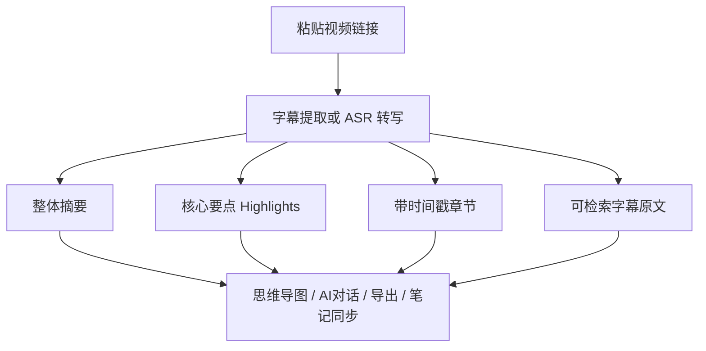
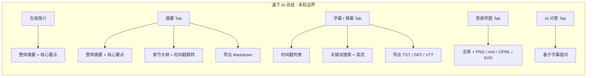

# 速下 SpeedyDL — AI 视频总结竞品调研

> 调研对象：[BibiGPT](https://bibigpt.co/) · [NoteGPT](https://notegpt.io/cn)
> 调研日期：2026-08 · 数据来源：官网 + Bing 搜索 + 第三方介绍页
> 用途：约束 [AI视频总结方案](./AI视频总结方案.md) 的能力边界与差异化策略
> 对照实现：`app/summarizer.py` · `POST /api/summarize` · `web/src/views/SummaryView.vue`

---

## 1. 产品定位对比

| 维度 | BibiGPT | NoteGPT | SpeedyDL |
|------|---------|---------|----------|
| 一句话定位 | AI 音视频知行助理（总结→内化→产出） | 全能 AI 学习工作台（视频只是入口之一） | 万能视频下载器 + 学习向总结扩展 |
| 创立/背景 | 2023 年，原名 BiliGPT / AI 课代表；创始人 JimmyLv（前 ThoughtWorks/阿里） | 面向全球 8000 万用户的 AI 学习平台；支持多模型（ChatGPT/DeepSeek/Claude/Gemini） | 学习项目；基于 yt-dlp + FastAPI + Vue 3 |
| 核心入口 | 粘贴链接 / 本地上传 / 浏览器插件 / 桌面端(Tauri) / 移动端(Expo) / 微信助理 | 粘贴链接 / 上传文件 / Chrome 扩展 / 网页工作台 | 首页解析结果卡上的「AI 总结」按钮 |
| 核心卖点 | 长视频速览；章节时间戳跳转；思维导图；AI 追问；笔记生态同步 | 多格式摘要（视频/PDF/PPT/图片/音频）；思维导图；时间戳转录；AI 对话；笔记管理 | 下载为主业；总结为字幕优先的轻量学习闭环 |
| 商业化 | 免费日额度；Plus / Pro / Lifetime；按量积分 | Freemium；Basic / Pro / Unlimited 三档配额制 | 演示 VIP 门禁；自备 LLM Key / Mock |
| 用户规模 | 超 5000 万用户（2025 年数据）；日均处理 16 亿词 | 全球 8000 万用户 | 学习演示，无真实用户运营 |

---

## 2. BibiGPT 详细分析

### 2.1 核心功能

- **音视频总结**：一键生成结构化摘要，准确率宣称 98%；支持 20+ 平台/格式。
- **字幕提取与转录**：视频转文字；支持本地 mp3/mp4/m4a/wav/srt/vtt/ass 等格式上传。
- **思维导图生成**：基于内容自动生成可视化知识树。
- **AI 对话追问**：基于视频内容的对话式学习（如"详解第三步操作逻辑"）。
- **章节时间戳**：带时间戳的章节大纲，可直接跳转到关键部分。
- **AI 改写降重**：保留原意优化表达，论文降重效率提升 40%。
- **多语言翻译**：23 种语言互译 + 文化适配。
- **笔记生态同步**：一键保存至 Notion / Obsidian / flomo / Readwise / 邮箱。
- **批量处理与 Vision**：Pro 版本支持批量处理和视觉（画面）理解能力。

### 2.2 支持平台

- **视频平台**：YouTube、B站、TikTok、抖音、快手、小红书、Twitter/X、Vimeo、TED、Coursera、Khan Academy，以及任意带音视频标签的网页。
- **播客/音频**：Apple Podcasts、Spotify、小宇宙、喜马拉雅。
- **本地文件**：mp3、mp4、m4a、wav、srt、vtt、ass。
- **客户端**：Web、浏览器扩展、桌面端（Tauri 2.x）、移动端（Expo）、微信助理。

### 2.3 AI 总结输出形式

| 输出形式 | 说明 |
|----------|------|
| 要点/大纲摘要 | 结构化的核心内容总述 |
| 章节时间戳大纲 | 带时间戳，可跳转播放 |
| 完整字幕/转录文本 | 视频转文字全文 |
| 思维导图 | 可视化知识结构树 |
| AI 对话 | 基于内容追问 |
| 改写/翻译 | 多模态创作支持 |

### 2.4 定价方案（2025-2026 最新）

| 版本 | 价格 | 说明 |
|------|------|------|
| 免费版 | ¥0 | 每日配额限制（约 30 分钟视频）；注册赠 120 分钟 |
| Plus 版 | $19.8/月 或 $142.56/年 | 标准个人版 |
| Pro 版 | $34.8/月 或 $250.56/年 | 含 Vision 视觉能力 + 批量处理 + API 访问 |
| 终身版 | $888（限量） | 一次性买断 |
| 按量付费 | $20（2000 积分）~ $200（40000 积分，单价 50% 折扣） | 7 天无风险退款 |

### 2.5 技术亮点

- **多模型协作**：支持 GPT-4o、Gemini Pro、Claude 3.5 等顶级模型自由切换。
- **Agent 生态**：前置提供 MCP server（OAuth 2.0 + Bearer）、REST OpenAPI 规范、NLWeb `/ask` 端点（SSE 流式）、Anthropic Skill 四种接入方式。
- **标准化发现接口**：`/.well-known/agent-card.json`（A2A）、`/llms.txt`、`/api/discover`，方便 AI Agent 自动发现和调用。
- **全平台客户端**：Web + 浏览器扩展 + 桌面端（Tauri 2.x）+ 移动端（Expo）。
- **隐私合规**：文件 30 天自动删除；符合 GDPR/CCPA；不未经同意使用用户数据训练。
- **部署架构**：全国专线 GPU 集群；沙箱隔离保障数据合规；支持企业私有化部署。

### 2.6 差异化卖点

1. **全链路知识闭环**：从"看视频"到"沉淀知识"的无缝衔接（Notion/Obsidian/flomo 深度绑定）。
2. **极度开放的 Agent 生态**：不仅是 ToC 应用，更是可被其他 AI Agent 调用的能力节点。
3. **海量平台兼容**：中英文主流长短视频 + 播客 + 任意网页 + 本地多格式文件。
4. **多模态处理**：Pro 版具备 Vision 视觉理解，能理解视频画面内容。

---

## 3. NoteGPT 详细分析

### 3.1 核心功能

- **多格式摘要器**：YouTube 视频、PDF、Word、PPT、图片、音频、文本、书籍、播客、文章等 10+ 类型。
- **AI 思维导图**：从内容自动生成交互式思维导图，直观展示知识结构。
- **时间戳转录**：一键提取视频/音频的带时间戳转录文本。
- **AI 聊天助手**：与 AI 对话澄清概念、提问答疑，深入理解内容。
- **自动快照笔记**：观看视频时自动捕捉关键信息，记录思考和想法。
- **笔记管理**：文件夹 + 标签 + 强大过滤器 + 搜索；建立个人笔记库和闪卡库。
- **多语言翻译**：支持英语、日语、韩语、法语等多种语言。
- **导出**：支持导出为 PDF 或 Word 文档。
- **Chrome 扩展**：轻量级侧边栏，实时总结网页视频，无需切换应用。

### 3.2 支持平台

- **网页端**：浏览器访问网站使用。
- **Chrome 扩展**：侧边栏 + 嵌入式面板，支持 YouTube 摘要器和网页摘要器。
- **移动端**：支持手机和平板（通过浏览器访问）。
- **多模型**：ChatGPT、DeepSeek、Claude、Gemini 可选。

### 3.3 AI 总结输出形式

| 输出形式 | 说明 |
|----------|------|
| 深度总结 | AI 生成的视频内容总述 |
| Highlights | 关键高光要点 |
| Key Insights | 核心洞见 |
| 思维导图 | 可视化知识结构（MindMap Tab） |
| 时间戳转录 | 完整字幕文本（可下载 TXT/SRT） |
| Card | 知识卡片（Card Tab） |
| 多语言翻译 | Translate Tab |

### 3.4 定价方案（2025-2026 最新）

> NoteGPT 采用配额制（Credits），每个 AI 服务消耗一个配额；免费用户 15 个配额。

| 版本 | 月费 | 年费 | 每月配额 |
|------|------|------|----------|
| 基础版（Basic） | $2.08 | $25 | 200 个 |
| 专业版（Pro） | $6.92 | $83 | 1000 个 |
| 热门版（Unlimited） | $19.92 | $239 | 无限 |

### 3.5 技术亮点

- **20 秒概览**：从任意内容快速生成摘要，节省 60% 时间。
- **多模型支持**：ChatGPT、DeepSeek、Claude、Gemini 自由切换。
- **轻量 Chrome 扩展**：侧边栏实时总结，10 倍生产力。
- **笔记 + 闪卡库**：不仅是总结工具，更是知识管理平台。
- **AI 工具套件**：演示文稿生成、抽认卡、流程图、论文写作等集成。

### 3.6 差异化卖点

1. **全能学习工作台**：视频只是入口之一，覆盖 PDF/PPT/图片/音频/文章等全格式。
2. **笔记生态闭环**：快照笔记 + 文件夹管理 + 闪卡库，打造个人知识库。
3. **多模型可选**：用户可根据任务选择不同大模型。
4. **教育场景深耕**：面向学生、教师、研究员、律师等明确人群。

---

## 4. 共性能力与 SpeedyDL 边界

### 4.1 竞品能力共性图谱

### 4.2 能力对比矩阵

| 能力 | BibiGPT | NoteGPT | SpeedyDL 现状 | 本轮迭代 |
|------|---------|---------|---------------|----------|
| 摘要 + 要点 + 章节 | ✅ | ✅ | ✅ | 保持 |
| 章节时间戳跳转 | ✅ | ❌（未明确） | ⚠️（基础已有，待增强） | **做**（修复跳转 + 切字幕 Tab 高亮） |
| 字幕/转录（时间戳） | ✅ | ✅ | ✅ | 保持 |
| 字幕搜索 | ✅ | ✅ | ⚠️（过滤模式） | **做**（关键词高亮 + 匹配导航） |
| 思维导图可视化 | ✅ | ✅ | ✅（树形） | **增强**：全屏 + PNG + `.mm`/OPML 可编辑导出 |
| AI 问答（针对视频） | ✅ | ✅ | ✅ | 保持 |
| 导出文件 | ✅（多格式） | ✅（PDF/Word） | ✅ Markdown；字幕/弹幕 TXT·SRT·VTT；导图 PNG·mm·OPML·SVG | **做**（Markdown + 字幕多格式 + 导图互通） |
| 无字幕 ASR | ✅ | ❌ | ❌ | **不做** |
| 多格式摘要（PDF/PPT 等） | ❌ | ✅ | ❌ | **不做** |
| 笔记同步（Notion 等） | ✅ | ✅ | ❌ | **不做** |
| 账号计费配额 | ✅ SaaS | ✅ Freemium | 演示 VIP | 保持演示 |
| 多模型切换 | ✅ | ✅ | ❌（单一 OpenAI 兼容） | **不做** |
| 浏览器扩展 | ✅ | ✅ | ❌ | **不做** |

### 4.3 SpeedyDL 差异化策略

SpeedyDL 的主价值仍是**「下载 + 解析」**，AI 总结是学习向的轻量扩展，不追求成为完整工作台。本轮迭代后，SpeedyDL 的 AI 总结能力边界如下：

**核心差异化**：

1. **下载优先**：竞品是纯总结工具，SpeedyDL 是下载器 + 总结扩展，用户可先下载再总结。
2. **字幕优先**：仅依赖平台自带字幕，不做 ASR（成本可控、准确率高）。
3. **自备 Key**：用户自带 OpenAI 兼容 API Key，无配额限制；无 Key 时 Mock 演示。
4. **轻量闭环**：五 Tab + 左侧简介 + 导出 / 导图增强，覆盖学习核心需求，不堆砌工作台功能。
5. **本地优先**：总结结果存 sessionStorage，不依赖服务端持久化；隐私可控。

---

## 5. 调研启示与方案约束

### 5.1 从竞品得到的启示

| 启示点 | 来源 | 对 SpeedyDL 的影响 |
|--------|------|-------------------|
| 章节时间戳跳转是学习效率关键感知 | BibiGPT | 本轮**增强**章节跳转：修复参数 + 切字幕 Tab 高亮对应句 |
| 输出分层（总述→要点→章节）比大段摘要更易扫读 | NoteGPT | 现有结构已对齐，保持 |
| 字幕搜索高亮是基础期望 | 两者均有 | 本轮**新增**关键词高亮 + 匹配导航 |
| 导出能力是知识沉淀的入口 | 两者均有 | 本轮**新增** Markdown/TXT 导出 |
| ASR / 多模型 / 笔记同步成本高 | 两者均为 SaaS 级 | 首期**不做**，保持轻量 |
| 思维导图非最小闭环必需但提升体验 | 两者均有 | 保持现有树形导图，不追求交互级 |

### 5.2 进入方案 / 开发的约束

1. **目标**：总结详情页四能力（摘要 · 字幕 · 思维导图 · AI 问答）+ 三项新能力（章节跳转增强 · 字幕搜索高亮 · 导出 Markdown/TXT）。
2. **无字幕**：首期不做 ASR；真实模式可读报错；Mock 可用元数据演示。
3. **门禁**：保持演示 VIP（`vip_token=demo-vip`）。
4. **验收**：Mock 模式跑通四 Tab + 三项新能力；配置真实 API Key 后用有字幕视频验证 LLM 模式。

---

## 6. 数据来源

| 来源 | 链接 | 用途 |
|------|------|------|
| BibiGPT 官网 | https://bibigpt.co/ | 产品定位、功能列表、定价、Agent 生态 |
| BibiGPT 终极指南 | https://www.willenyao.com/a/BibiGPT | 技术演进、应用场景、数据规模 |
| NoteGPT 官网 | https://notegpt.io/cn | 产品定位、核心功能 |
| NoteGPT Bilibili 总结器 | https://notegpt.io/cn/bilibili-summarizer | 使用流程、输出形式 |
| NoteGPT AI 神器大全 | https://aishenqi.net/tool/notegpt | 详细功能、定价方案 |
| NoteGPT moge.ai 介绍 | https://moge.ai/zh/product/notegpt | 功能矩阵、使用场景 |
| Bing 搜索 | BibiGPT / NoteGPT 关键词 | 交叉验证定价与功能信息 |
